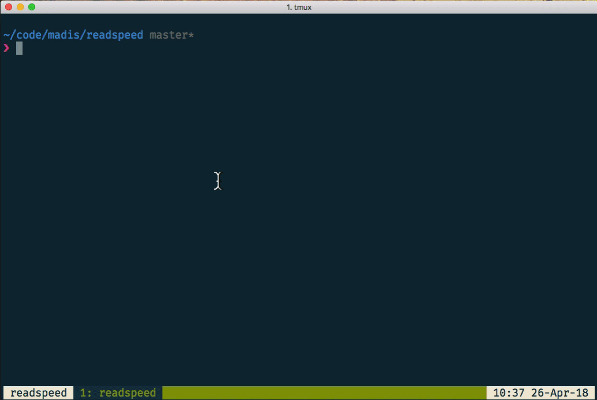

# Readspeed

Cli tool that records your reading speed and provides summary.

## Installation

1. Install with: `gem install readspeed`
2. Then run `readspeed`

## Usage

After starting readspeed will start recording your page reading speed.
When you finish reading page, press [ENTER] and timing of next page begins.
Couple other commands are available as well. They can be seen during the app run by entering `help` or `h`.

When you exit the application with `quit` or `q`, it will record your reading session into `yaml` file in the directory that you ran the `readspeed` command from.

## Contributing

Bug reports and pull requests are welcome on GitHub at https://github.com/[USERNAME]/readspeed.

## License

The gem is available as open source under the terms of the [MIT License](https://opensource.org/licenses/MIT).
